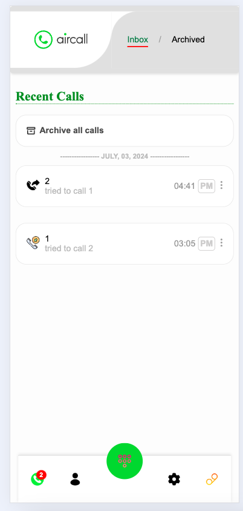
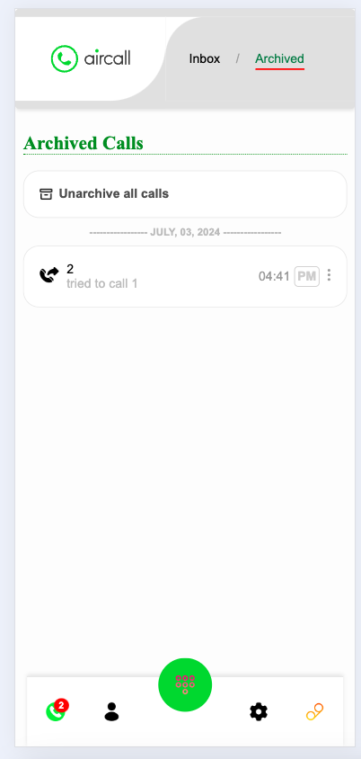
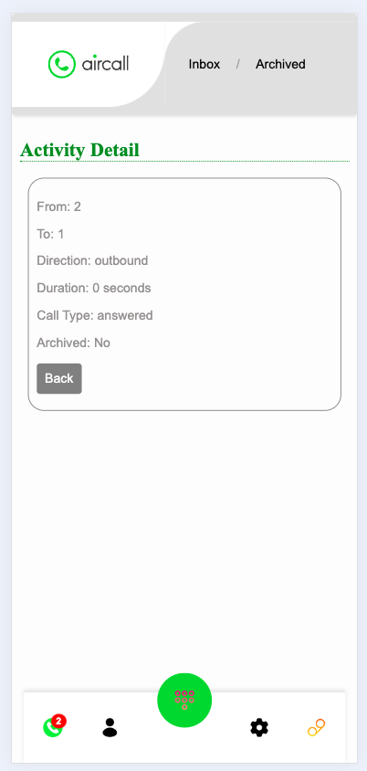

# Assignment Deployed Here:
- **Vercel**: https://c55d643f.vercel.app/

# Aircall Activity Feed

This project is a small ReactJS app designed as a coding test for Aircall. The application includes features for displaying call activities, viewing call details, archiving and unarchiving calls, and navigation between different sections.

## Features

- **Activity Feed**: Displays a list of call activities.
- **Activity Detail**: Shows details of a selected call.
- **Archive and Unarchive**: Allows archiving and unarchiving of individual or all calls.
- **Navigation**: Includes a top navbar for navigating between "Inbox" and "Archived" sections, and a bottom navbar for additional features.

## Technologies Used

- **React**: Frontend framework for building the user interface.
- **React Router**: For handling navigation and routing within the app.
- **Webpack**: Module bundler for compiling JavaScript modules.
- **CSS**: Styling the components.

## Project Structure

- **components/**: Contains all the React components used in the project.
  - `ActivityFeed.jsx`: Component to display the list of call activities.
  - `ArchivedCalls.jsx`: Component to display the list of archived calls.
  - `ActivityDetail.jsx`: Component to display the details of a selected call.
  - `BottomNavbar.jsx`: Component for the bottom navigation bar.
  - `CallDetails.jsx`: Component to display detailed call information.
  - `Contacts.jsx`: Component to display the contacts.
  - `Dialpad.jsx`: Component for the dialpad.
  - `Settings.jsx`: Component for settings.
  - `Voicemail.jsx`: Component for voicemail.
- **api/**: Contains the API functions to fetch data.
  - `index.js`: Functions to fetch activity data and update activity status.
- **pages/**: Contains the main page components.
  - `index.jsx`: Main entry point of the application.
- **public/**: Contains the HTML template.
  - `index.html`: HTML template for the application.
- **src/**: Contains the main app component and other necessary files.
  - `App.jsx`: Main App component.
  - `Header.jsx`: Component for the header.
  - `index.js`: Entry point for the React application.
- **styles/**: Contains the CSS files for styling the application.
  - `app.css`: Main CSS file for the application.

## Setup and Installation

### Prerequisites

- Node.js (v16 or higher)
- npm (Node package manager)

### Installation

1. Clone the repository:
   ```bash
   git clone <repository-url>
   cd aircall-reactjs-webpack

 2. Install dependencies:

   npm install
 
 3. Running the App
  To run the application locally:

npm start
This will start the development server and open the application in your default web browser. The app will be running at http://localhost:8080.

Building the App
To build the application for production:

npm run build
This will create a dist directory with the compiled files.

Usage
View Activities: The main page shows the list of call activities.
View Call Details: Click on a call activity to view its details.
Archive Calls: Click on the "Archive" button next to a call to archive it.
Unarchive Calls: Go to the "Archived" section and click on the "Unarchive" button next to a call to unarchive it.
Archive/Unarchive All: Use the "Archive all calls" button to archive all calls, and the "Unarchive all calls" button in the "Archived" section to unarchive all calls.
Navigation: Use the top navbar to navigate between "Inbox" and "Archived" sections.
Customization
Feel free to customize the styles and components to match your design preferences.

Known Issues
Ensure you have the correct version of Node.js and npm installed.
If you encounter any issues, try running npm cache clean --force and reinstalling the dependencies.
License
This project is licensed under the MIT License.


